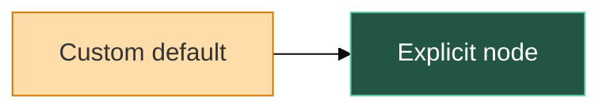

# Mermaid theme defaults (local prototype)

The native Markdown renderer receives the active Zed theme through the existing
`build_mermaid_theme` mapping. Theme changes continue to invalidate diagram caches.
No extension API or additional dependency is required. Native SVG fallback labels
retain their resolved text colors; diagram backgrounds use the effective palette.

Color precedence:

1. Explicit `style`, `classDef` and `linkStyle` colors retain Mermaid's CSS priority.
2. Diagram front matter or init directives can select a Mermaid preset or supply
   color-valued `themeVariables`.
3. Otherwise, Zed supplies the default colors and automatic player-color accents.

With a custom palette, Zed's post-render color overlays are omitted for the whole
diagram. Unspecified variables still use the Zed site configuration; selecting a
preset other than `base` selects that preset's palette instead. Consequently,
custom palettes do not receive Zed's extra per-node accent coloring.

The renderer preprocesses configuration using merman's existing parser and
validates color overrides with its color parser. `render_to_svg` returns an error
for malformed configuration, unknown presets or non-color `themeVariables`.
Arbitrary `themeCSS`, font and numeric theme-variable overrides remain outside
this prototype; merman's secure source policy is retained. Diagram layout
configuration continues through the existing renderer.

Markdown diagram detection now accepts front matter, init directives and leading
comments while passing the original source to the renderer. The existing diagram
family allowlist remains unchanged.

This is a Zed core change, not a Mermaid Plus extension update. It uses the pinned
merman 0.8.0-alpha.5 engine (Mermaid 11.16.1 baseline); it does not add complete
Mermaid 12 support. No changes have been submitted or merged for this prototype.

Validation:

- `cargo test -p mermaid_render --locked`
- `cargo test -p markdown mermaid --lib --locked`
- `cargo build -p zed --features gpui_platform/runtime_shaders --locked`

The runtime shader feature is an existing macOS build option. It allows a local
build with Command Line Tools by compiling Metal shaders at runtime.

For a standalone SVG: `cargo run -p mermaid_render --example render -- input.mmd output.svg`.
