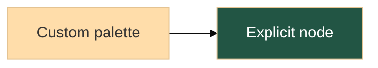

# Mermaid color precedence

Zed's existing theme mapping supplies default diagram colors. Explicit `style`,
`classDef` and `linkStyle` colors take precedence, including native SVG labels.
Theme changes continue to invalidate the existing diagram cache.

Front matter and init directives can override color-valued `themeVariables`.
For example:

With a custom palette, additional Zed color overlays are omitted; SVG compatibility
fixes still run. Unspecified colors use Zed defaults. Explicit backgrounds remain
unchanged. The existing merman parser validates configuration and color values;
invalid colors or non-color `themeVariables` return an error from `render_to_svg`.
Arbitrary `themeCSS` remains disabled. This patch does not add preset customization,
font configuration, new diagram families or dependencies.

This local Zed core patch uses the pinned merman engine (Mermaid 11.16.1 baseline).
It does not add complete Mermaid 12 support or change the Mermaid Plus extension.
